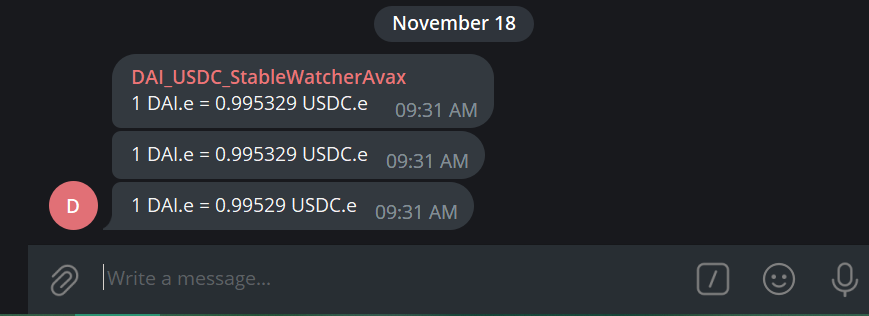

# Generic Stable Watcher

<a href="#introduction">Introduction</a> &nbsp;&bull;&nbsp;
<a href="#installation">Installation</a> &nbsp;&bull;&nbsp;
<a href="#usage">Usage</a> &nbsp;&bull;&nbsp;
<a href="#customisations">Customisations</a> &nbsp;&bull;&nbsp;
<a href="#issue">Issue?</a>

## Introduction
Generic Stable Watcher is a simple script which will alert users via telegram on any exploitable price opporunities on a given pair of cryptocurrencies.

- The program is extendable where it can be used to monitor different chains (Ethereum, AVAX, Moonbeam etc.)
- Sends messages with no delay to a group via telegram
- The script can be used to either send numerous messages to give live updates on the exchange or only whenever there is a arbitrage opportunity 

  

## Installation
- Follow [this](https://medium.com/@ManHay_Hong/how-to-create-a-telegram-bot-and-send-messages-with-python-4cf314d9fa3e) tutorial and setup a Telegram Bot
- pip install -r /path/to/requirements.txt
- You are all set to go!

## Usage
- Simply run the code in vscode or whatever in IDE you use and follow the prompts on screen
 or
- python genericStablecoinWatcher.py in the command line if you are in the same directory as the code

## Customisations
- network.connect() - this can be change to the many [other chains](https://eth-brownie.readthedocs.io/en/stable/network-management.html) which are available from Brownie

## Issue
- Head over to the issues page if you find any bugs

## Credits
- Massive shoutout to [BowTiedDevil](https://github.com/BowTiedDevil) and his [Substack](https://degencode.substack.com/). 
- Highly recommend if you are interested in Crypto Arbitrage you should go check him out

<h4>Liked the work ?</h4>
Give the repository a star 🌟